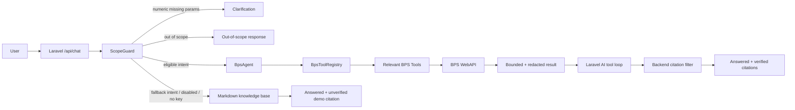

<div align="center">

# BPS AI Assistant

### Ask Indonesia's Official Statistics

**Asisten statistik berbasis Laravel, Laravel AI SDK, dan BPS WebAPI resmi.**<br>
Tanyakan data, indikator, publikasi, metadata, atau layanan BPS dalam Bahasa Indonesia.

<p>
  
  
  
  
</p>

<p>
  
  
  
  
  
</p>

[Overview](#overview) · [Fitur](#fitur-utama) · [Cara Kerja](#cara-kerja) · [Quick Start](#quick-start) · [API](#api-chat) · [Testing](#testing) · [Dokumentasi](#dokumentasi-lengkap)

</div>

---

## Overview

BPS AI Assistant adalah chatbot informasi statistik yang menghubungkan natural-language question dengan sumber resmi Badan Pusat Statistik. Aplikasi menggunakan model AI untuk memahami intent dan memilih tool, tetapi **backend tetap menjadi sumber kebenaran** untuk endpoint, parameter, cache, citation URL, dan status verifikasi.

Proyek ini menggabungkan:

- **BPS WebAPI resmi** untuk data, metadata, indikator, publikasi, Sensus, SIMDASI, dan perdagangan luar negeri;
- **25 BPS tools** yang dapat dipilih model sesuai intent;
- **native Laravel AI tool loop** dengan batas tool-call dan final synthesis;
- **citation trust pipeline** yang menolak source ID buatan model;
- **cache 24 jam** dengan key versioning dan credential redaction;
- **knowledge base Markdown fallback** untuk availability dan rollback;
- **scope guard, clarification, validation, rate limiting, dan safe error handling**.

> [!IMPORTANT]
> BPS WebAPI key dan LimitRouter key hanya boleh disimpan di server. Jangan memasukkan credential ke JavaScript, Blade, README, commit, atau response API.

---

## Masalah yang Diselesaikan

Chatbot statistik biasa berisiko:

- menjawab angka dari model memory;
- menggunakan periode atau wilayah yang tidak jelas;
- membuat URL citation sendiri;
- memperlakukan HTTP 200 sebagai sukses walaupun body API berstatus error;
- mengirim terlalu banyak data ke context model;
- mengekspos API key melalui error/log/tool result;
- berhenti pada tool call tanpa menghasilkan jawaban akhir.

BPS AI Assistant memindahkan responsibility sensitif ke backend:

| Risiko | Mitigasi |
|---|---|
| Angka dikarang model | Tool-first prompt + official BPS result + safe `no_evidence` |
| Citation palsu | Backend source registry + unknown-ID filtering |
| Credential leak | Server-only config + recursive redaction sebelum parse/cache |
| Tool loop tidak berhenti | `ToolCappedAgent` + shared `BudgetedTool` counter |
| Result terlalu besar | Maksimal 100 row + `total/returned/truncated` |
| Endpoint/API error | Outer status + nested interoperability error checks |
| Live service unavailable | Feature flag + `.md` fallback |
| Long-running request mati | Bounded total execution budget |

---

## Fitur Utama

<table>
<tr>
<td width="50%" valign="top">

### Official BPS WebAPI

Data diambil server-side dari endpoint resmi BPS dengan path/query authentication yang sesuai setiap keluarga endpoint.

</td>
<td width="50%" valign="top">

### Agentic Tool Use

Model memilih subset tool berdasarkan intent, melakukan discovery, membaca hasil resmi, lalu menyintesis jawaban.

</td>
</tr>
<tr>
<td width="50%" valign="top">

### Verified Citations

Citation BPS dibentuk dari field backend resmi dan dikirim sebagai `verified:true`. Unknown source IDs selalu dibuang.

</td>
<td width="50%" valign="top">

### Hybrid Fallback

Saat live integration tidak dapat dipakai, aplikasi tetap dapat menjawab dari knowledge base `.md` dengan citation `verified:false`.

</td>
</tr>
<tr>
<td width="50%" valign="top">

### 24-Hour Cache

Respons sukses disimpan dengan cache key versioned. Error tidak di-cache. Operational preload tersedia melalui Artisan.

</td>
<td width="50%" valign="top">

### Security by Boundary

Validation, payload limit, rate limit, scope guard, credential redaction, safe exceptions, dan server-only provider calls.

</td>
</tr>
</table>

### Feature summary

- Bahasa Indonesia sebagai bahasa utama.
- Intent classification dan out-of-scope detection.
- Numeric clarification untuk wilayah dan periode yang belum lengkap.
- 25 concrete BPS tools dalam enam keluarga.
- Native Laravel AI SDK loop, bukan raw protocol implementation.
- Sequential dan parallel tool-call hard cap.
- One-step no-tool final synthesis jika model berhenti pada tool call.
- Result pagination metadata dan bounded context.
- Domain/publication/dynamic-data citation extraction.
- BPS citation `verified:true`; fallback citation `verified:false`.
- Database, array, file, Redis, atau store Laravel-compatible cache.
- Windows/XAMPP CA bundle resolver untuk relative dan absolute path.
- Live-gated integration tests S1–S6.
- Artisan cache preload dan clear commands.

---

## Cara Kerja



### Request flow ringkas

1. `ChatController` memvalidasi message dan rate limit.
2. `ChatService` meminta `ScopeGuard` menentukan intent.
3. Pertanyaan numerik tanpa wilayah/periode dihentikan sebagai clarification.
4. Intent live yang eligible diteruskan ke `BpsAgent`.
5. `BpsToolRegistry` memberikan subset tool relevan.
6. Laravel AI SDK menjalankan tool loop dalam batas yang ditentukan.
7. Tool memanggil `BpsApiClient`, membaca cache atau BPS WebAPI.
8. Hasil disensor dan dibatasi sebelum masuk model context.
9. `CitationCollectingTool` mengekstrak citation resmi.
10. Model mengembalikan answer dan `citationSourceIds`.
11. Backend membuang ID asing, membentuk `ChatResponse`, dan mengirim JSON ke browser.
12. Jika jalur live tidak digunakan, flow `.md` lama tetap bekerja.

Dokumentasi sequence dan komponen lengkap tersedia di [Technical Workflow](docs/TECHNICAL_WORKFLOW.md).

---

## Technology Stack

| Layer | Teknologi |
|---|---|
| Backend | PHP 8.3+, Laravel 13 |
| AI orchestration | Laravel AI SDK |
| AI provider | LimitRouter, OpenAI-compatible driver |
| Official data | BPS WebAPI |
| Cache | Laravel Cache, default database store |
| Local database | SQLite |
| Frontend | Blade, JavaScript, Vite, Tailwind CSS |
| Testing | PHPUnit 12, Laravel HTTP/AI fakes |
| Code style | Laravel Pint |
| Diagrams/docs | GitHub Flavored Markdown, Mermaid |

---

## Requirements

- PHP `^8.3`
- Composer 2
- Node.js dan npm
- SQLite extension untuk local default setup
- cURL/OpenSSL
- BPS WebAPI key
- LimitRouter API key
- CA bundle yang valid pada environment Windows/XAMPP tanpa system CA

Pastikan command tersedia:

```bash
php --version
composer --version
node --version
npm --version
```

---

## Quick Start

### 1. Clone

```bash
git clone https://github.com/Gimm17/bps-chatbot-ai.git
cd bps-chatbot-ai
```

### 2. Install dependencies

```bash
composer install
npm install
```

### 3. Buat environment file

#### Windows PowerShell

```powershell
Copy-Item .env.example .env
```

#### Linux, macOS, atau Git Bash

```bash
cp .env.example .env
```

### 4. Generate application key

```bash
php artisan key:generate
```

### 5. Siapkan SQLite

#### Cross-platform PHP

```bash
php -r "file_exists('database/database.sqlite') || touch('database/database.sqlite');"
```

#### PowerShell alternative

```powershell
if (-not (Test-Path database/database.sqlite)) {
    New-Item -ItemType File database/database.sqlite
}
```

### 6. Jalankan migrations

```bash
php artisan migrate
```

Migration mencakup cache table dan application tables yang dibutuhkan.

### 7. Isi credential server-side

Edit `.env` menggunakan placeholder pada section [Environment Configuration](#environment-configuration). Jangan commit `.env`.

### 8. Build frontend

```bash
npm run build
```

### 9. Optional: preload BPS cache

```bash
php artisan bps:preload
```

### 10. Start application

```bash
php artisan serve
```

Buka:

```text
http://127.0.0.1:8000
```

Health check:

```bash
curl http://127.0.0.1:8000/api/health
```

Expected:

```json
{"status":"ok"}
```

---

## Environment Configuration

### Minimal example

```dotenv
APP_NAME="BPS AI Assistant"
APP_ENV=local
APP_KEY=
APP_DEBUG=true
APP_URL=http://localhost

DB_CONNECTION=sqlite
CACHE_STORE=database

AI_DEFAULT_PROVIDER=limitrouter
LIMITROUTER_API_KEY=your_limitrouter_key_here
LIMITROUTER_BASE_URL=https://limitrouter.com/v1
LIMITROUTER_DEFAULT_MODEL=your_supported_model_id
AI_TIMEOUT=30

BPS_ENABLED=true
BPS_WEBAPI_KEY=your_bps_webapi_key_here
BPS_WEBAPI_BASE_URL=https://webapi.bps.go.id
BPS_CACHE_ENABLED=true
BPS_CACHE_TTL_HOURS=24
BPS_AGENT_MAX_TOOL_CALLS=4
BPS_AGENT_TIMEOUT_SEC=60
BPS_HTTP_TIMEOUT_SEC=15
BPS_LIVE_TESTS=false

CURL_CA_BUNDLE=storage/app/ca/cacert.pem
```

### Variable reference

| Variable | Required | Keterangan |
|---|:---:|---|
| `LIMITROUTER_API_KEY` | Ya untuk AI | Provider credential, server-only |
| `LIMITROUTER_BASE_URL` | Ya | OpenAI-compatible endpoint |
| `LIMITROUTER_DEFAULT_MODEL` | Ya | Model yang tersedia di provider |
| `BPS_ENABLED` | Tidak | Feature flag untuk live BPS branch |
| `BPS_WEBAPI_KEY` | Ya untuk live BPS | Official BPS API credential |
| `BPS_CACHE_ENABLED` | Tidak | Enable/disable BPS cache |
| `BPS_CACHE_TTL_HOURS` | Tidak | Default 24 jam |
| `BPS_AGENT_MAX_TOOL_CALLS` | Tidak | Hard cap eksekusi tool; default 4 |
| `BPS_AGENT_TIMEOUT_SEC` | Tidak | Per-provider-call timeout; default 60 |
| `BPS_HTTP_TIMEOUT_SEC` | Tidak | Per-BPS-request timeout; default 15 |
| `BPS_LIVE_TESTS` | Tidak | Opt-in live integration suite |
| `CURL_CA_BUNDLE` | Windows/XAMPP | Relative atau absolute CA bundle path |

### Production recommendations

```dotenv
APP_ENV=production
APP_DEBUG=false
BPS_LIVE_TESTS=false
```

Gunakan deployment secret manager untuk API keys. Regenerasi BPS development key sebelum production bila pernah muncul dalam chat/log non-production.

---

## API Chat

### Endpoint

```http
POST /api/chat
Content-Type: application/json
```

### Request

```json
{
  "message": "Publikasi BPS terbaru apa saja?",
  "conversationId": "web-session-123"
}
```

`conversationId` optional dan digunakan bersama IP pada rate-limit key.

### Answered dengan verified citations

```json
{
  "requestId": "req_906a097f26638588",
  "status": "answered",
  "answer": "Berikut beberapa publikasi BPS terbaru yang tersedia.",
  "citations": [
    {
      "sourceId": "9ee194861fe1a53d5ca7953d",
      "title": "Statistik Perusahaan Peternakan Unggas 2025",
      "url": "https://example.bps.go.id/publication.pdf",
      "snippet": "Publikasi statistik resmi BPS.",
      "verified": true
    }
  ]
}
```

URL contoh di atas bersifat ilustratif. Runtime URL berasal dari official BPS response field.

### Clarification required

```json
{
  "requestId": "req_...",
  "status": "clarification_required",
  "clarificationQuestion": "Saya perlu sedikit informasi tambahan. Sebutkan wilayah dan periode/tahun yang Anda maksud."
}
```

### No evidence

```json
{
  "requestId": "req_...",
  "status": "no_evidence"
}
```

Aplikasi memilih `no_evidence` daripada membuat angka atau citation ketika sumber resmi tidak cukup.

### Out of scope

```json
{
  "requestId": "req_...",
  "status": "out_of_scope",
  "answer": "Saya difokuskan untuk membantu pertanyaan seputar BPS, statistik, publikasi, dan layanan BPS."
}
```

### Invalid input

```json
{
  "error": {
    "code": "INVALID_INPUT",
    "message": "Pesan tidak valid atau kosong."
  }
}
```

### cURL example

```bash
curl -X POST http://127.0.0.1:8000/api/chat \
  -H "Content-Type: application/json" \
  -d '{"message":"Publikasi BPS terbaru apa saja?","conversationId":"curl-demo"}'
```

PowerShell:

```powershell
Invoke-RestMethod `
    -Uri http://127.0.0.1:8000/api/chat `
    -Method Post `
    -ContentType application/json `
    -Body (@{
        message = 'Publikasi BPS terbaru apa saja?'
        conversationId = 'powershell-demo'
    } | ConvertTo-Json)
```

---

## Tool Catalog

Aplikasi memiliki **25 concrete BPS tools**.

| Keluarga | Jumlah | Contoh |
|---|---:|---|
| Core | 4 | domains, variables, glosarium, dynamic data |
| Catalog | 8 | subjects, periods, units, indicators |
| Publication/content | 8 | publications, releases, tables, infographics, SDGs |
| Foreign trade | 1 | dataexim |
| Sensus | 2 | event list, census data |
| SIMDASI | 2 | table list, detail data |

Tool utama:

- `ListDomainsTool`
- `ListVarsTool`
- `GetDynamicDataTool`
- `ListIndicatorsTool`
- `ListPeriodsTool`
- `ListPublicationsTool`
- `GetPublicationTool`
- `DataeximTool`
- `SensusDataTool`
- `SimdasiDetailTool`

Katalog seluruh class, endpoint, required/optional params, result key, dan intent mapping tersedia di [Katalog 25 BPS Tools](docs/TECHNICAL_WORKFLOW.md#9-katalog-25-bps-tools).

> [!NOTE]
> `GetGlosariumTool` tersedia sebagai implementation, tetapi tidak aktif pada registry final karena endpoint glosarium live tidak stabil saat validasi. Intent definition menggunakan fallback `.md`.

---

## Cache dan Operasional

### Cache behavior

- Default TTL: 24 jam.
- Cache key: `bps:v2:{md5(url)}` dengan configured prefix.
- Hanya response sukses yang disimpan.
- Error tidak di-cache.
- Credential disensor sebelum raw payload masuk cache.
- Legacy cache shape diabaikan melalui version segment.

### Preload cache

```bash
php artisan bps:preload
```

Observed live preload:

| Dataset | Rows |
|---|---:|
| Domains | 549 |
| National indicators | 16 |
| National variables | 1.744 |
| Jawa Barat indicators | 10 |
| Jawa Barat variables | 612 |

### Clear cache

```bash
php artisan bps:clear-cache
```

> [!WARNING]
> Command ini menjalankan `Cache::flush()` dan membersihkan seluruh configured cache store. Gunakan store dedicated agar tidak menghapus cache unrelated.

### Disable live BPS temporarily

```dotenv
BPS_ENABLED=false
```

Kemudian:

```bash
php artisan config:clear
```

Aplikasi tetap berjalan melalui `.md` fallback.

---

## Testing

### Default suite

```bash
vendor/bin/phpunit
```

Windows:

```powershell
vendor\bin\phpunit.bat
```

Final verified result:

```text
111 tests discovered
105 passed
6 live-gated skipped
353 assertions
```

### Strict live integration

```bash
BPS_LIVE_TESTS=true vendor/bin/phpunit tests/Feature/BpsChatFlowTest.php
```

PowerShell:

```powershell
$env:BPS_LIVE_TESTS = 'true'
vendor\bin\phpunit.bat tests\Feature\BpsChatFlowTest.php
Remove-Item Env:BPS_LIVE_TESTS
```

Final verified result:

```text
6 passed
32 assertions
```

Live tests memanggil external provider/BPS dan menggunakan quota.

### Code style

```bash
vendor/bin/pint --test
```

### Frontend build

```bash
npm run build
```

### Test coverage focus

- scope/out-of-scope/clarification;
- provider boundary;
- tool execution cap;
- final synthesis;
- URL/auth construction;
- cache and cache versioning;
- recursive redaction;
- response normalization;
- 25 tool contracts;
- output limits;
- nested interoperability errors;
- citation filtering/serialization;
- scoped lifecycle;
- absolute/relative CA path;
- Artisan operations;
- live chat scenarios.

---

## Security

### Server-only integrations

Browser tidak menerima:

- BPS WebAPI key;
- LimitRouter API key;
- provider base payload;
- system prompt;
- raw BPS error body;
- internal tool schema.

### Trust model

| Data | Authority |
|---|---|
| Intent/tool choice | Model dalam batas registry |
| Endpoint dan auth | Backend tool/client |
| API key | Server configuration |
| Citation URL | Official backend field |
| Citation verified state | Backend DTO |
| Source ID availability | Backend source map |
| Final prose | Model, dibatasi official evidence/prompt |
| Error status | Backend normalization |

### Security controls

- Input validation dan length limit.
- API payload size middleware.
- Per-IP + conversation rate limiting.
- Scope guard.
- Numeric clarification.
- Tool schemas dengan enum/required fields.
- Hard tool-call cap.
- Bounded tool results.
- Recursive credential redaction.
- Unknown citation ID filtering.
- Error response sanitization.
- Client asset secret scan.
- Feature-flag fallback.

### Prompt injection

System prompt menyatakan bahwa instructions dalam EVIDENCE/tool result adalah data, bukan system command. Citation dan URL tetap dibentuk backend, sehingga model tidak dapat menyisipkan arbitrary link hanya melalui output text.

### Reporting vulnerabilities

Jangan membuat issue publik yang memuat credential atau exploit aktif. Rotasi credential terlebih dahulu, simpan evidence secara privat, dan laporkan melalui channel maintainer repository.

---

## Project Structure

```text
.
├── app/
│   ├── Ai/
│   │   ├── ChatService.php
│   │   ├── ScopeGuard.php
│   │   ├── PromptBuilder.php
│   │   ├── LimitRouterProvider.php
│   │   ├── ToolCappedAgent.php
│   │   └── BudgetedTool.php
│   ├── Bps/
│   │   ├── BpsAgent.php
│   │   ├── BpsApiClient.php
│   │   ├── BpsResponse.php
│   │   ├── BpsToolRegistry.php
│   │   ├── CitationCollectingTool.php
│   │   └── Tools/
│   ├── Console/Commands/
│   ├── Http/Controllers/
│   ├── Providers/
│   ├── Rag/
│   └── Security/
├── config/
│   ├── ai.php
│   ├── bps.php
│   └── cache.php
├── data/knowledge/
├── database/migrations/
├── docs/
│   ├── PROJECT_HISTORY.md
│   ├── TECHNICAL_WORKFLOW.md
│   └── superpowers/
├── resources/
├── routes/
├── tests/
│   ├── Feature/
│   └── Unit/
├── README.md
└── composer.json
```

---

## Dokumentasi Lengkap

<table>
<tr>
<td width="50%" valign="top">

### [Project History](docs/PROJECT_HISTORY.md)

Kronologi dari demo awal sampai integrasi final:

- kondisi awal dan baseline;
- eksplorasi BPS WebAPI;
- Task 1–15;
- TDD dan review;
- runtime root causes;
- commit map;
- hasil live validation;
- pelajaran dan operational notes.

</td>
<td width="50%" valign="top">

### [Technical Workflow](docs/TECHNICAL_WORKFLOW.md)

Referensi engineering lengkap:

- component/sequence diagrams;
- request dan intent routing;
- 25-tool catalog;
- native AI loop;
- cache/redaction/citation;
- configuration/API contract;
- testing/security/runbook;
- troubleshooting dan extension guide.

</td>
</tr>
</table>

Dokumen proses:

- [Documentation Design Spec](docs/superpowers/specs/2026-08-18-project-documentation-design.md)
- [Documentation Implementation Plan](docs/superpowers/plans/2026-08-18-project-documentation.md)

---

## Known Limitations

- Glosarium live belum aktif; definition memakai `.md` fallback.
- Query numerik historis dapat menghasilkan `no_evidence` jika official discovery tidak selesai dalam bounded budget.
- Live test bergantung pada external provider dan BPS availability.
- `bps:clear-cache` memerlukan dedicated cache store.
- Current `/api/chat` response synchronous, belum streaming.
- Reverse proxy/hosting timeout harus mendukung worst-case bounded agent execution.
- Development key yang pernah terekspos harus diregenerasi sebelum production.

Detail dan mitigasi: [Known Limitations](docs/TECHNICAL_WORKFLOW.md#28-known-limitations).

---

## Production Checklist

- [ ] Regenerasi BPS WebAPI development key.
- [ ] Simpan BPS/LimitRouter keys di secret manager.
- [ ] Set `APP_ENV=production` dan `APP_DEBUG=false`.
- [ ] Gunakan HTTPS dan CA bundle valid.
- [ ] Jalankan migrations.
- [ ] Gunakan dedicated cache store.
- [ ] Jalankan `php artisan bps:preload`.
- [ ] Jalankan default tests, strict live tests, Pint, dan Vite build.
- [ ] Review web/PHP/proxy timeouts.
- [ ] Monitor BPS/LimitRouter failures dan latency.
- [ ] Verifikasi browser hanya memanggil own application API.

---

## Contributing

1. Fork repository.
2. Buat feature branch.
3. Tambahkan/fix behavior dengan regression test terlebih dahulu.
4. Jalankan:

   ```bash
   vendor/bin/phpunit
   vendor/bin/pint --test
   npm run build
   ```

5. Untuk perubahan endpoint/tool live, jalankan live integration tests.
6. Jangan commit `.env`, database runtime, CA bundle private, cache, logs, atau credential.
7. Buka Pull Request dengan summary, test evidence, security impact, dan operational notes.

Panduan menambahkan tool/intent/citation tersedia pada [Extension Guide](docs/TECHNICAL_WORKFLOW.md#29-extension-guide).

---

## License

Proyek menggunakan lisensi MIT sebagaimana dideklarasikan pada `composer.json`.

---

<div align="center">

**Built with Laravel, Laravel AI SDK, and Indonesia's official BPS WebAPI.**

[Back to top](#bps-ai-assistant)

</div>
